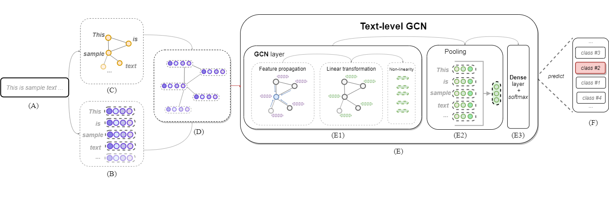
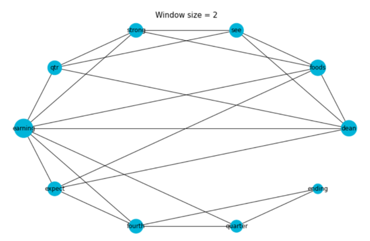
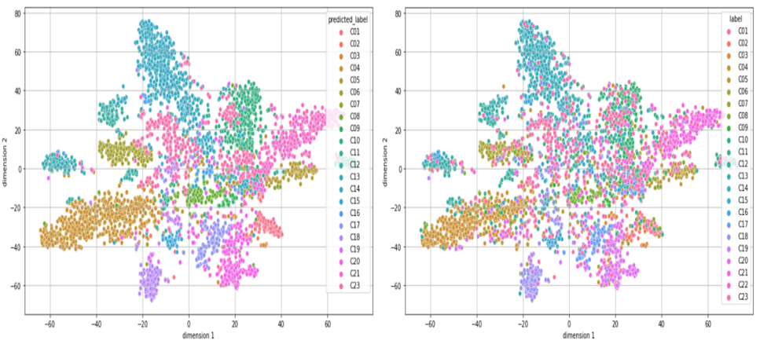

# Text-level-GCN
Source code of the final course paper "Enhancing Word Embeddings with Graph-Based Text Representations"

  
---

---

| Name    |   accuracy_mean |   accuracy_max |   accuracy_min |   accuracy_std |
|:--------|----------------:|---------------:|---------------:|---------------:|
| 20ng    |            86.1 |           86.8 |           85   |            0.7 |
| R52     |            93.8 |           94   |           93.5 |            0.2 |
| R8      |            97.4 |           97.6 |           97.2 |            0.1 |
| ohsumed |            68.9 |           69.7 |           68.5 |            0.3 |

